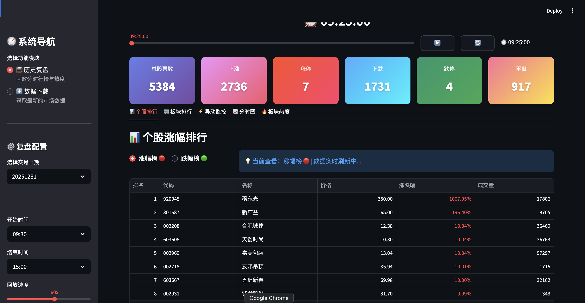
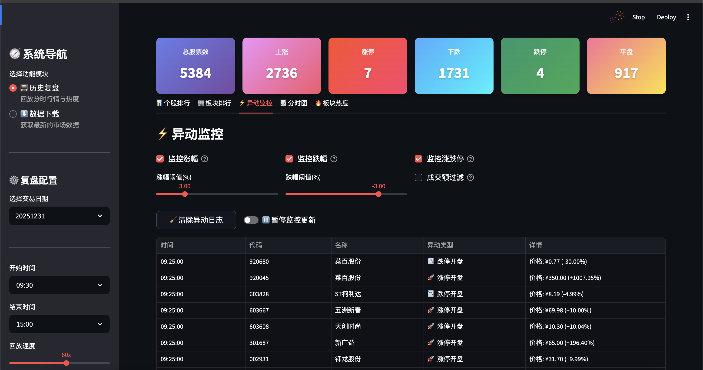
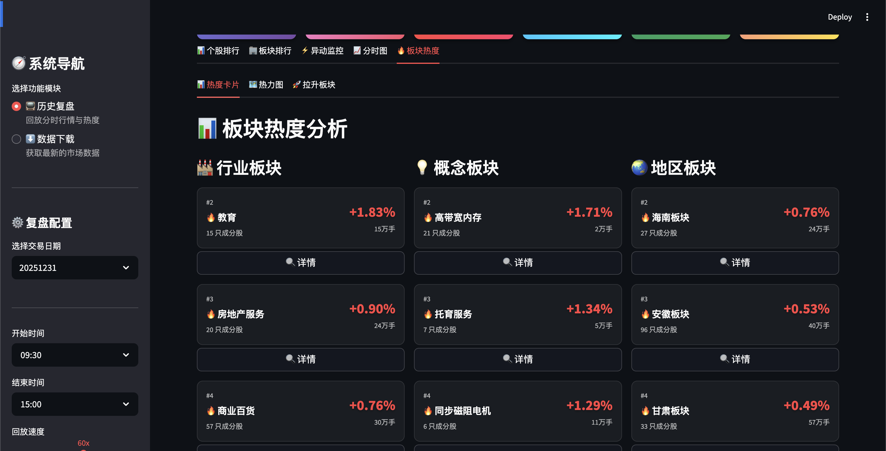
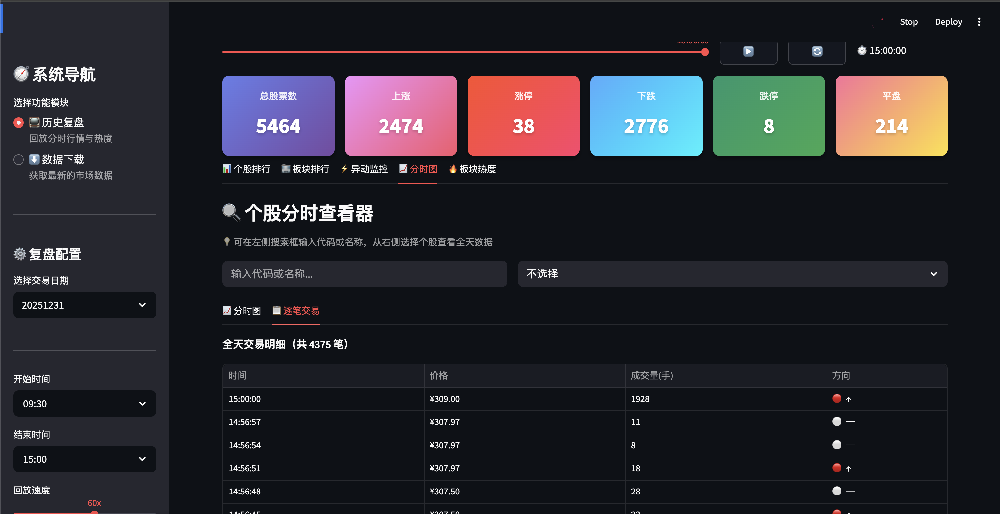

# 📈 复盘啦 (A-Share Historical Replay System)

一个基于 Python 的 A 股历史全量分时成交复盘系统，支持秒级数据回放、实时排行榜模拟计算、板块轮动分析及异动监控。

---

## ✨ 核心特性

- 🚀 **高性能回放**: 支持全市场 5000+ 股票同步秒级回放，采用 Parquet 存储格式加速读取。
- 📊 **市场快照模拟**: 完美模拟盘中实时涨跌分布、个股涨幅榜、板块涨幅榜。
- 🏢 **多维板块分析**:
    - 支持 **iWencai (i问财)** 与 **Eastmoney (东方财富)** 两种板块分类格式。
    - 实时计算板块平均涨幅，捕捉板块热点。
    - 板块热力图及卡片化排行展示。
- ⚡ **智能异动监控**: 全新异动检测引擎，支持配置化监控个股快速拉升、跳水及成交量异常。
- 🔍 **个股详情查看**: 点击个股直接调出精细分时走势图及逐笔成交明细。
- 🛠️ **一键配置化**: 通过 `config.py` 轻松管理服务器列表、回放速度、监控阈值等。

---

## � 功能清单 (Features)

### 数据采集与管理
- ✅ **多源数据下载**
  - 通达信服务器分时成交数据 (Tick) 自动抓取
  - Web 界面可视化下载进度与状态监控
  - 智能并发控制与失败重试机制
  - 支持按日期范围批量下载

- ✅ **高效数据存储**
  - Parquet 列式存储格式，提升 10 倍读取速度
  - 按交易日期自动归档数据
  - 支持数据缓存策略，提升重复运行效率

### 复盘引擎
- ✅ **秒级精准回放**
  - 全市场 5000+ 股票同步秒级数据回放
  - 智能起始时间检测，自动定位首笔交易
  - 支持自定义交易时段配置
  - 多档倍速调节 (1x - 600x)
  - 时间轴拖拽快速定位

- ✅ **实时数据计算**
  - 基于真实昨收价的精准涨跌幅计算
  - 实时成交量、成交额统计
  - 换手率、振幅等技术指标动态计算
  - 分时均价线实时更新

### 市场分析
- ✅ **涨跌分布分析**
  - 实时统计涨停、跌停、涨跌分布
  - 可视化柱状图展示市场情绪
  - 支持 ST/非 ST 股票分类统计

- ✅ **排行榜系统**
  - 涨幅榜/跌幅榜实时排名
  - 成交额排行榜
  - 支持模糊搜索股票代码/名称
  - 快速筛选 ST 股票

- ✅ **板块轮动分析**
  - 支持 iWencai (i问财) 与 Eastmoney (东方财富) 双数据源
  - 实时计算板块平均涨幅
  - 板块热力图可视化
  - 板块成分股穿透分析
  - 板块排行榜 (Top 20)

### 异动监控
- ✅ **智能异动检测**
  - 可配置时间窗口 (1-60 分钟)
  - 快速拉升检测 (涨幅 > 阈值)
  - 快速跳水检测 (跌幅 < 负阈值)
  - 成交量异常过滤
  - 实时异动推送与历史记录

### 个股详情
- ✅ **分时走势图**
  - 高精度 Plotly 交互式图表
  - 分时价格曲线与均价线
  - 成交量柱状图联动显示
  - 涨跌停价格参考线

- ✅ **逐笔成交明细**
  - 完整 Tick 数据展示
  - 时间、价格、成交量详情
  - 支持数据导出

### 用户体验
- ✅ **现代化 UI 设计**
  - Streamlit 响应式布局
  - 暗色主题优化
  - 卡片化信息展示
  - 实时无闪烁刷新

- ✅ **灵活配置系统**
  - `config.py` 集中化配置管理
  - 服务器列表、回放速度、监控阈值等可视化调整
  - 板块数据源实时切换

---

## �🚀 快速部署

### 1. 环境准备
推荐使用 Python 3.9+。

```bash
# 克隆项目 (示例路径)
cd A-share-replay

# 安装必要依赖
pip install -r requirements.txt
```

### 2. 数据准备
系统运行需要 **分时成交数据 (Tick)** 和 **昨收价数据 (Pre-close)**。

#### Web 界面一键下载 (推荐)
1. 启动系统后，在左侧导航栏选择 **“⬇️ 数据下载”**。
2. 在日历中选择目标日期或日期范围。
3. 勾选数据类型并设置并发线程数。
4. 点击 **“🚀 开始下载”**，系统会自动完成所有抓取与存储。


### 3. 系统演示与操作
1. **启动**: `streamlit run app.py`
2. **复盘**: 在“历史复盘”页面选择对应交易日，点击播放开始回放。
3. **切换板块**: 在“显示设置”中实时切换 **iwencai** 或 **eastmoney** 映射格式。








---

## ⚙️ 系统配置说明 (`config.py`)

系统的大部分核心参数均可在 `config.py` 中直接修改：

| 配置模块 | 说明 |
|----------|------|
| `DOWNLOAD_CONFIG` | 下载并发数、白名单、通达信服务器列表 |
| `REPLAY_CONFIG` | 交易时段定义、默认回放速度 |
| `SECTOR_MAPPING_CONFIG` | **板块数据源选择** (`iwencai` 或 `eastmoney`) 及对应 CSV 路径 |
| `RAPID_RISE_CONFIG` | 异动监控的时间窗口（分钟）及默认阈值 |
| `CACHE_CONFIG` | 数据缓存策略，开启可提升重复运行速度 |

---

## 📂 项目结构

```text
├── app.py                  # Streamlit Web 主程序
├── replay_engine.py        # 核心回放及计算引擎
├── config.py               # 全局配置文件
├── downloader.py           # 历史分时数据下载工具
├── download_pre_close.py   # 昨收价高速下载工具
├── sector_analysis.py      # 板块可视化渲染逻辑
├── generate_industry_mapping.py # 板块映射生成/转换工具
├── data/                   # 数据存储目录
│   └── 20251230/           # 按日期存放
│       ├── tick/           # 分时 parquet 文件
│       └── stock_pre_close_20251230.csv
└── requirements.txt        # 依赖列表
```

---

## 💡 使用进阶

### 1. 切换板块格式
在 Web 界面左侧边栏 **“显示设置”** 中，您可以实时切换板块映射源。
- **iwencai**: 分类更全，包含海量概念分类，适合追逐短线热点。
- **eastmoney**: 基础分类清晰，适合观察大盘权重行业走势。

### 2. 回放控制
- **手动定位**: 拖动时间轴滑块可快速跳转至任一时刻。
- **倍速调节**: 支持最高 600x 倍速（即现实 1 秒对应回放 10 分钟）。
- **暂停/继续**: 用于详细分析某一时刻的盘面细节。

### 3. 性能优化建议
- **内存建议**: 若内存不足 (≤16GB)，系统默认开启“惰性加载”，仅在需要时读取数据。
- **Parquet 格式**: 强烈建议不要修改数据存储格式，Parquet 的压缩与读取效率是 CSV 的 10 倍以上。

---

## 🎯 开发计划 (TODO)

### 1. 📰 盘中新闻联动 (In-Progress News Integration)

#### 1.1 新闻数据源接入
- [ ] **财联社快讯接入**
  - 实时抓取财联社 24 小时全球快讯
  - 按时间戳归档新闻数据
  - 新闻内容结构化存储 (标题、内容、时间、标签)

- [ ] **东方财富资讯接入**
  - 个股公告实时抓取
  - 行业/板块新闻聚合
  - 研报快讯自动采集

- [ ] **新浪财经要闻接入**
  - 7x24 小时快讯流
  - 热点事件标签提取

#### 1.2 新闻与行情联动分析
- [ ] **时间轴融合**
  - 在复盘时间轴上同步显示新闻事件
  - 新闻事件标记点击查看详情
  - 支持按新闻时间快速定位行情

- [ ] **个股新闻关联**
  - 自动识别新闻中提及的股票代码
  - 在个股详情页展示相关新闻
  - 新闻发布时刻与价格变动关联分析

- [ ] **板块新闻聚合**
  - 按板块/概念聚合相关新闻
  - 热点板块新闻舆情统计
  - 新闻驱动的板块异动识别

#### 1.3 新闻事件回测
- [ ] **事件驱动回测**
  - 重大新闻发布前后 N 分钟行情对比
  - 统计新闻驱动的平均涨跌幅
  - 生成新闻事件影响力报告

### 2. 🐉 盘后龙虎榜数据分析 (Dragon-Tiger List Analysis)

#### 2.1 龙虎榜数据采集
- [ ] **东方财富龙虎榜数据**
  - 每日龙虎榜上榜股票自动抓取
  - 营业部买卖明细数据采集
  - 上榜原因分类存储 (涨停、跌停、振幅、换手)

- [ ] **历史龙虎榜归档**
  - 按交易日归档龙虎榜数据
  - 构建营业部交易档案数据库
  - 游资席位标签化管理

#### 2.2 营业部分析
- [ ] **知名游资席位识别**
  - 自动识别"赵老哥"、"章盟主"等知名席位
  - 席位操作风格画像 (打板、低吸、波段)
  - 席位历史成功率统计

- [ ] **席位协同分析**
  - 检测多个席位同时买入同一股票
  - 营业部"抱团"股票挖掘
  - 席位对手盘分析 (买方 vs 卖方)

#### 2.3 龙虎榜策略回测
- [ ] **次日溢价率统计**
  - 龙虎榜上榜后次日表现统计
  - 按上榜原因分类统计收益
  - 按席位类型分类统计收益

- [ ] **跟单策略模拟**
  - 模拟跟随知名席位买入
  - 不同持有期 (1日/3日/5日) 收益统计
  - 最优跟单策略挖掘

#### 2.4 可视化展示
- [ ] **龙虎榜日历**
  - 按日期展示每日上榜股票
  - 点击查看详细买卖明细

- [ ] **席位排行榜**
  - 按成功率/频次排名营业部
  - 席位操作时间热力图

### 3. 🤖 AI 数据统计分析 (AI-Powered Analytics)

#### 3.1 市场情绪分析
- [ ] **AI 盘面总结**
  - 基于 LLM 自动生成每日复盘报告
  - 涨跌分布、板块轮动、异动事件智能摘要
  - 市场情绪量化评分 (恐慌/贪婪指数)

- [ ] **新闻情绪分析**
  - 使用 NLP 分析新闻情绪倾向
  - 识别利好/利空关键词
  - 新闻情绪与行情走势相关性分析

#### 3.2 模式识别与预测
- [ ] **技术形态识别**
  - AI 识别经典K线形态 (头肩顶、双底等)
  - 分时图形态模式匹配
  - 异动形态分类 (脉冲、单边、震荡)

- [ ] **板块轮动预测**
  - 基于历史数据训练板块轮动模型
  - 预测下一个可能启动的板块
  - 板块生命周期识别 (启动/加速/衰退)

- [ ] **异动预警增强**
  - 结合成交量、换手率、新闻等多维度特征
  - AI 预测个股短期异动概率
  - 异动股票质量评分

#### 3.3 量化策略回测
- [ ] **策略开发框架**
  - 支持自定义量化策略编写
  - 策略回测引擎 (基于历史 Tick 数据)
  - 策略绩效评估 (夏普比率、最大回撤等)

- [ ] **AI 策略优化**
  - 使用强化学习优化交易策略参数
  - 多策略组合优化
  - 策略过拟合检测

#### 3.4 智能报告生成
- [ ] **自动化复盘报告**
  - 每日自动生成 PDF/Markdown 复盘报告
  - 包含涨跌分布、龙虎榜、新闻事件、异动股等
  - 支持邮件/微信自动推送

- [ ] **个股诊断报告**
  - AI 分析个股技术面、基本面、资金面
  - 生成个股买卖建议 (仅供参考)
  - 风险提示与止损建议

#### 3.5 数据可视化增强
- [ ] **3D 市场全景图**
  - 树状图展示市场资金流向
  - 板块/个股热力气泡图
  - 交互式探索式分析


---

## ⚠️ 免责声明

本系统仅供量化投资学习与复盘研究使用。数据来源于公开网络接口，**不保证数据的完整性与时效性**，严禁用于任何商业用途或实际非法交易。

---

**Star 支持**: 如果这个项目对你有帮助，请给个 ⭐！
